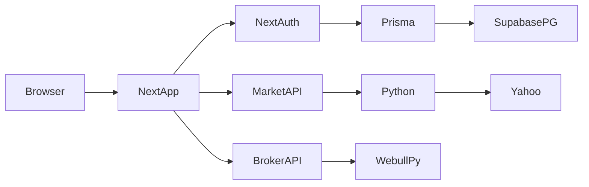

# Foundation pass — Project Oracle

Approved plan. Do not treat this file as implemented work.

Map Project Oracle as a self-hosted Next.js desk with real NextAuth accounts, then stabilize it for a public deploy: clone-buildable, login/session baseline, legal pages, dependency/dead-code slim, and one signup/login smoke test. No new product features.

## Todos

- [ ] Phase 1 — runnable: Fix gitignore/Insights import split; move admin helpers to committed lib/auth; npm test + build pass from a clone
- [x] Phase 2 — security: Session cookies, prod NEXTAUTH_SECRET, login/signup rate limit, generic signup errors, redact .env.example, ignore leftover token; then security-auditor + verifier
- [x] Phase 3 — legal: Add /privacy and /terms; link from login/signup; honest personal-project copy
- [x] Phase 4 — slim: Remove unused shadcn/layouts/deps, lib/db.ts, stub login route, project_oracle_v.5 token; keep sonner + auth/webull/insights behavior
- [x] Phase 5 — smoke: Vitest smoke for gated signup + credentials authorize; keep existing Webull tests
- [x] Lock foundation: Commit thin AGENTS.md, two .cursor/rules, SECURITY.md; stop. No new features.

---

Phase 0 map is below. Work the five phases in order. After each phase, run verifier. After phase 2 (auth/public routes), run security-auditor (readonly). Stop when the lock-the-foundation files exist. Do not add features (no password reset, OAuth, CI, CSP rewrite, account-deletion API, or Webull trading expansion).

You confirmed a public deploy is coming, so treat strangers as able to hit this app.

---

## Phase 0 — map (do not implement)

**What it is.** Self-hosted market desk: login, sector watchlist, ticker grid, detail modal (Yahoo via Python), paper journal, optional YouTube ingest + Insights, optional admin Webull broker/trading (flags default off). GitHub: [Aditya-S06/InvestmentDashboard](https://github.com/Aditya-S06/InvestmentDashboard) (public). Local tree is ahead of `main` (last GitHub push 2026-07-28); this pass is on the **working tree**.

**How to run.** From [README.md](README.md): Node 20+, Python 3.10+, `.venv`, copy [.env.example](.env.example) → `.env`, link Supabase (`npm run db:link`) or optional Docker Postgres (`npm run db:up`), `npx prisma generate` + seed, `npm run dev` → http://localhost:3000. Demo: `john@doe.com` / `johndoe123` (skip with `SEED_DEMO_USER=false`).

**Stack.** Next.js 14.2 / React 18 / Tailwind / NextAuth v4 JWT credentials / Prisma 6 → Supabase Postgres (preferred) or Compose Postgres 16 / Python `yfinance` + Webull SDK + YouTube libs. `@supabase/server` is in [package.json](package.json) and unused; there is no browser Supabase client.

**What is public today.**

- Source: public GitHub (MIT). No Vercel/Fly/Docker app image, no GitHub Actions, no production URL in repo.
- Cloud DB: `.env.example` embeds real project ref `yqugkmikyfpmgjawebfr` (not the DB password).
- If you host the Next process: `/login`, `/`, `/api/auth/*`, gated `/api/signup`. Dashboard pages need a session ([middleware.ts](middleware.ts) matcher `/dashboard/:path*` only). **APIs are not in the matcher**; they self-gate.

**Login/signup is real.**

- Login: [lib/auth.ts](lib/auth.ts) CredentialsProvider + `bcrypt.compare` + JWT session (`user.id` on token). UI: `signIn('credentials')` in [app/login/_components/login-form.tsx](app/login/_components/login-form.tsx).
- Signup: [app/api/signup/route.ts](app/api/signup/route.ts) creates a hashed User (cost 12, min 12 chars). Gated by `ALLOW_PUBLIC_SIGNUP` (default **false** in `.env.example` and [lib/auth/signup.ts](lib/auth/signup.ts)). Sign Up tab hidden when off.
- Stub [app/api/auth/login/route.ts](app/api/auth/login/route.ts) is not login.
- No rate limit on login/signup. No custom cookie flags (NextAuth defaults: HttpOnly, SameSite=Lax, Secure only on HTTPS).
- Admin: [lib/auth/require-admin.ts](lib/auth/require-admin.ts) via `ADMIN_EMAILS` / `role=admin`. Broker routes use `requireBrokerAdmin`. User data routes use `requireUser` and `userId` filters (watchlist / paper / journal).

**Where secrets live.**

- Runtime: `.env` (gitignored) — `DATABASE_URL`, `DIRECT_URL`, `NEXTAUTH_SECRET`, `OPENROUTER_API_KEY`, `YOUTUBE_API_KEY`, `WEBULL_APP_KEY` / `_SECRET`.
- Webull OAuth cache: `WEBULL_TOKEN_DIR` (default `conf/`), gitignored via `conf/*`.
- **Leak risk:** untracked [project_oracle_v.5/conf/token.txt](project_oracle_v.5/conf/token.txt) is **not** covered by `conf/*`.
- Demo password is in README + [scripts/seed.ts](scripts/seed.ts).
- Insights core (`lib/insights/access.ts`, `config.ts`, `orchestrator.ts`, …) is gitignored; committed routes still import those files.

**Known broken / clone-hostile.**

- Committed files import gitignored Insights modules ([app/api/insights/chat/route.ts](app/api/insights/chat/route.ts), [lib/auth/require-admin.ts](lib/auth/require-admin.ts)). A clean clone cannot `next build`.
- [AGENTS.md](AGENTS.md) exists locally but is gitignored and still Docker-first vs README’s Supabase-first.
- No privacy/terms pages. One Vitest file only: [lib/webull/orders.test.ts](lib/webull/orders.test.ts). `eslint.ignoreDuringBuilds: true` in [next.config.js](next.config.js).
- Health [app/api/health/route.ts](app/api/health/route.ts) is admin-only (fine).

---

## Phase 1 — runnable + testable

**Goal.** A clone with `.env` + Python venv can install, typecheck/build, and `npm test` without copying secret gitignored TS.

**Do**

1. Break the gitignore split for **non-secret** modules that committed code imports (`access`, `config`, `rate-limit`, `orchestrator`, `tools`, `context-builder` as needed). Keep harness markdown/skills gitignored. Move admin helpers (`isInsightsAdmin`, `syncAdminRole`, `getAdminEmails`) into a committed file such as `lib/auth/admin.ts` so [lib/auth/require-admin.ts](lib/auth/require-admin.ts) does not depend on Insights internals.
2. Confirm `npm test` (existing Webull tests) and `npm run build` (or `tsc`) on the working tree.
3. Align run docs: README already good; note `npm test` in the script table. Do not rewrite Webull/Insights product docs.
4. Do **not** enable `ALLOW_PUBLIC_SIGNUP` or seed the demo user for production.

**Verify.** `npm test` green; build does not require files listed in [.gitignore](.gitignore) under `lib/insights/`.

**Out of scope.** New CI, turning ESLint back on for builds (optional one-line later, not required here).

---

## Phase 2 — security baseline (login / session / user data)

Assume the Next app will be reachable by strangers. Apply only what this stack already has.

**Do**

1. **Cookies** in [lib/auth.ts](lib/auth.ts): explicit session cookie HttpOnly, SameSite=`lax`, `secure` when `NODE_ENV === 'production'` (or HTTPS). Fail fast in production if `NEXTAUTH_SECRET` is missing/placeholder.
2. **Rate-limit** `authorize()` (login) and `POST /api/signup` with a small in-memory limiter (same pattern as Insights). Document in SECURITY.md that this is per-process, not multi-instance.
3. **Signup enumeration:** do not return a distinct “User already exists” (409). Same generic error as other failures; keep 201 only on create.
4. **Secrets hygiene:** replace real Supabase host/ref in [.env.example](.env.example) with placeholders; gitignore `project_oracle_v.5/` (or delete the leftover token file — do not commit it); keep `ALLOW_PUBLIC_SIGNUP=false`; document `SEED_DEMO_USER=false` before deploy.
5. **Authz audit (fix only if broken):** every user-data read/write already uses `requireUser` + `userId`. Confirm paper/journal/watchlist IDOR; do not refactor those modules. Broker stays admin-only. Leave RLS migrations as-is (Prisma DB role bypasses RLS; PostgREST already revoked — document, don’t redesign).
6. Remove or leave the stub `/api/auth/login` for phase 4 (dead surface). Do not add CORS `*`. Existing headers in [next.config.js](next.config.js) stay.

**Do not.** Password reset, email verification, hashing stored `ApiKey` rows (plaintext keys: call out in SECURITY.md), Webull live trading, CSP overhaul, public unauthenticated `/api/health`.

**Then.** Spawn security-auditor (readonly) on the auth/public-route diff. Spawn verifier.

---

## Phase 3 — legal pages (accounts exist)

Follow the legal-pages skill. Personal portfolio tone. No SOC2 / bank-grade claims. Not legal advice.

**Do**

- Add `/privacy` and `/terms` (App Router pages) matching the existing dark login look.
- Privacy: personal project; data = email, name, hashed password, watchlist, paper/journal, optional API keys, server logs; not sold; third parties actually used (Supabase Postgres, Yahoo via yfinance, optional OpenRouter / YouTube / Webull); deletion by contacting the operator; service may shut down.
- Terms: as-is, not investment advice, acceptable use, accounts may be removed, limitation of liability. Omit governing law (no jurisdiction given).
- Contact: GitHub issues on Aditya-S06/InvestmentDashboard unless you supply an email at execute time.
- Link from [app/login/_components/login-form.tsx](app/login/_components/login-form.tsx), signup path when enabled, and a one-line footer on login (no site-wide footer exists today). Do not block the app behind a consent modal.

**Then.** Verifier (pages render; login still works).

---

## Phase 4 — slim bloat (not node_modules as source)

Behavior-preserving. Do not touch auth logic, Prisma migrations, Webull order engine, or Insights harness.

**Delete / ignore**

- [project_oracle_v.5/](project_oracle_v.5/) leftover (token) after gitignore.
- Unused [lib/db.ts](lib/db.ts) (duplicate of [lib/prisma.ts](lib/prisma.ts), zero imports).
- Stub [app/api/auth/login/route.ts](app/api/auth/login/route.ts).
- Unused shadcn tree: ~48 files under `components/ui/` plus `components/layouts/*`, `components/theme-toggle.tsx`, `hooks/use-toast.ts` — **keep** `components/ui/sonner.tsx` (used by [app/layout.tsx](app/layout.tsx)). Confirm with import graph before delete.
- Unused deps with no remaining imports, including at least: `@supabase/server`, `@headlessui/react`, `jsonwebtoken`, `cookie`, `dayjs`, `gray-matter`, `react-datepicker`, `react-hot-toast`, `react-select`, `react-use`, `react-intersection-observer`, `@floating-ui/react`, `@hookform/resolvers`, most unused `@radix-ui/*` after UI kit removal, direct `webpack` if Next still bundles it. Re-grep before uninstall.

**Do not** merge paper/journal HTTP helpers, rewrite dashboard components, or delete Insights `.example.ts` files until committed implementations exist (phase 1).

**Then.** `npm test` + build. Verifier.

---

## Phase 5 — one smoke test (signup / login)

Smallest test that protects the main path. Vitest is already configured ([vitest.config.ts](vitest.config.ts)); do not add Playwright.

**Do** — `lib/auth/signup.test.ts` and `lib/auth/auth.login.test.ts` (or one `test/auth.smoke.test.ts`):

- Signup disabled → 403.
- Signup enabled: hash + create; duplicate email does not leak existence (matches phase 2).
- `authorize`: unknown user / bad password → `null`; valid bcrypt → user id/email.
- Mock Prisma; do not hit live Supabase.

Keep [lib/webull/orders.test.ts](lib/webull/orders.test.ts) green. List `npm test` in README.

**Then.** Verifier. This is the last implementation phase.

---

## Lock the foundation (after phases 1–5)

- **Committed thin [AGENTS.md](AGENTS.md):** install, run, test, env, “do not commit `.env` / `conf/token.txt` / Insights harness”, “APIs must `requireUser`/`requireAdmin`”, “no prediction copy”. Stop gitignoring this thin file; keep long local notes gitignored under other names if needed.
- **[.cursor/rules/](.cursor/rules/)** only for mistakes that already happened: (1) committed routes must not import gitignored TS; (2) no real project refs or tokens in `.env.example`.
- **[SECURITY.md](SECURITY.md):** hashed passwords, cookie flags, rate limits, signup gate, RLS/PostgREST note, demo seed warning. Out of scope: live Webull, multi-instance rate limit, plaintext `ApiKey` table, no formal audit.

Stop. New features wait until this pass is merged.

---

## Explicitly deferred

Webull live trading, Insights harness commit, password reset, account-deletion API, CI, CSP, hashing broker API keys, turning ESLint on during `next build`, merging HTTP helpers, public health endpoint.
